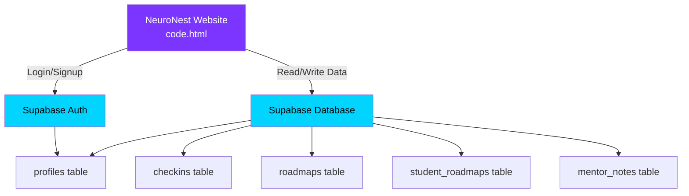

# 🚀 NeuroNest — Complete Supabase Setup Guide

This guide walks you through setting up Supabase as the backend for your NeuroNest mentorship website. It covers account creation, database tables, authentication, and the exact SQL to run.

---

## Step 1: Create a Supabase Account & Project

1. Go to **[supabase.com](https://supabase.com)** and click **Start your project**
2. Sign up with **GitHub** (easiest) or **email**
3. Once logged in, click **New Project**
4. Fill in:
   - **Project name:** `NeuroNest`
   - **Database password:** Choose a strong password (save it somewhere safe!)
   - **Region:** Choose the closest to India → `South Asia (Mumbai)`
5. Click **Create new project** and wait ~2 minutes for setup

---

## Step 2: Get Your API Keys

Once the project is ready:

1. Click **⚙️ Project Settings** (gear icon, bottom-left sidebar)
2. Click **API** in the left menu
3. You will see two important values — **copy both and save them**:

| Key | Where to find | What it does |
|-----|--------------|--------------|
| **Project URL** | Under "Project URL" | The address of your database |
| **anon public key** | Under "Project API keys" → `anon` `public` | Lets your website talk to Supabase |

> [!IMPORTANT]
> You will paste these two values into your [code.html](file:///c:/Users/HP/OneDrive/Desktop/Vedanta%20Associates/daily%20reports%20of%20Mentorship%20Project/website/code.html) later. They look like this:
> - URL: `https://abcdefghijk.supabase.co`
> - Key: `eyJhbGciOiJIUzI1NiIs...` (a very long string)

---

## Step 3: Set Up Authentication

Your website has **two types of users**: Students and Admins (mentors). Supabase Auth handles login/signup for you.

1. In sidebar, click **Authentication**
2. Click **Providers** tab
3. Make sure **Email** is **enabled** (it should be by default)
4. Under **Email** settings:
   - **Turn OFF** "Confirm email" (for now, to make testing easier)
   - This means users can log in immediately without checking their email

> [!TIP]
> Later, when your site is live, you can turn email confirmation back ON for security.

---

## Step 4: Create Database Tables

This is the most important step. You need to create tables that match your website's data.

1. In sidebar, click **SQL Editor** (the `<>` icon)
2. Click **New query**
3. **Copy-paste the SQL below** into the editor
4. Click **Run** (the green play button)

### 4A: Profiles Table
This stores user info (name, role, batch, avatar, bio, study hours).

```sql
-- Profiles table: stores user details
CREATE TABLE profiles (
  id UUID PRIMARY KEY REFERENCES auth.users(id) ON DELETE CASCADE,
  email TEXT UNIQUE NOT NULL,
  full_name TEXT NOT NULL,
  role TEXT NOT NULL DEFAULT 'student' CHECK (role IN ('student', 'admin')),
  batch TEXT,
  avatar_gradient INTEGER DEFAULT 0,
  bio TEXT DEFAULT '',
  study_hours INTEGER DEFAULT 6,
  created_at TIMESTAMPTZ DEFAULT NOW()
);

-- Allow users to read all profiles, but only edit their own
ALTER TABLE profiles ENABLE ROW LEVEL SECURITY;

CREATE POLICY "Anyone can read profiles"
  ON profiles FOR SELECT
  USING (true);

CREATE POLICY "Users can update own profile"
  ON profiles FOR UPDATE
  USING (auth.uid() = id);

CREATE POLICY "Allow insert for authenticated users"
  ON profiles FOR INSERT
  WITH CHECK (auth.uid() = id);
```

### 4B: Check-ins Table
This stores daily student check-ins (mood, target, goals, notes).

```sql
-- Check-ins table: daily student submissions
CREATE TABLE checkins (
  id BIGINT GENERATED ALWAYS AS IDENTITY PRIMARY KEY,
  student_id UUID REFERENCES profiles(id) ON DELETE CASCADE,
  target TEXT NOT NULL,
  mood INTEGER NOT NULL CHECK (mood BETWEEN 1 AND 5),
  goals TEXT NOT NULL CHECK (goals IN ('Yes', 'No', 'Partial')),
  note TEXT DEFAULT '',
  study_hours REAL DEFAULT 0,
  created_at TIMESTAMPTZ DEFAULT NOW()
);

ALTER TABLE checkins ENABLE ROW LEVEL SECURITY;

CREATE POLICY "Students can insert own checkins"
  ON checkins FOR INSERT
  WITH CHECK (auth.uid() = student_id);

CREATE POLICY "Students can read own checkins"
  ON checkins FOR SELECT
  USING (auth.uid() = student_id);

CREATE POLICY "Admins can read all checkins"
  ON checkins FOR SELECT
  USING (
    EXISTS (
      SELECT 1 FROM profiles WHERE id = auth.uid() AND role = 'admin'
    )
  );
```

### 4C: Roadmaps Table
This stores the ideal roadmap published by the admin/mentor.

```sql
-- Roadmaps table: weekly study plans from mentor
CREATE TABLE roadmaps (
  id BIGINT GENERATED ALWAYS AS IDENTITY PRIMARY KEY,
  title TEXT NOT NULL,
  week_number INTEGER NOT NULL,
  day_label TEXT NOT NULL,
  physics TEXT DEFAULT '',
  chemistry TEXT DEFAULT '',
  maths TEXT DEFAULT '',
  created_by UUID REFERENCES profiles(id),
  created_at TIMESTAMPTZ DEFAULT NOW()
);

ALTER TABLE roadmaps ENABLE ROW LEVEL SECURITY;

CREATE POLICY "Everyone can read roadmaps"
  ON roadmaps FOR SELECT
  USING (true);

CREATE POLICY "Admins can manage roadmaps"
  ON roadmaps FOR ALL
  USING (
    EXISTS (
      SELECT 1 FROM profiles WHERE id = auth.uid() AND role = 'admin'
    )
  );
```

### 4D: Student Custom Roadmaps
This stores student-modified versions of the roadmap.

```sql
-- Student custom roadmaps
CREATE TABLE student_roadmaps (
  id BIGINT GENERATED ALWAYS AS IDENTITY PRIMARY KEY,
  student_id UUID REFERENCES profiles(id) ON DELETE CASCADE,
  week_number INTEGER NOT NULL DEFAULT 1,
  day_label TEXT NOT NULL,
  physics TEXT DEFAULT '',
  chemistry TEXT DEFAULT '',
  maths TEXT DEFAULT '',
  updated_at TIMESTAMPTZ DEFAULT NOW(),
  UNIQUE(student_id, week_number, day_label)
);

ALTER TABLE student_roadmaps ENABLE ROW LEVEL SECURITY;

CREATE POLICY "Students manage own roadmaps"
  ON student_roadmaps FOR ALL
  USING (auth.uid() = student_id);

CREATE POLICY "Admins can view student roadmaps"
  ON student_roadmaps FOR SELECT
  USING (
    EXISTS (
      SELECT 1 FROM profiles WHERE id = auth.uid() AND role = 'admin'
    )
  );
```

### 4E: Mentor Notes
This stores notes the mentor writes about each student.

```sql
-- Mentor notes about students
CREATE TABLE mentor_notes (
  id BIGINT GENERATED ALWAYS AS IDENTITY PRIMARY KEY,
  student_id UUID REFERENCES profiles(id) ON DELETE CASCADE,
  mentor_id UUID REFERENCES profiles(id),
  note TEXT NOT NULL,
  created_at TIMESTAMPTZ DEFAULT NOW()
);

ALTER TABLE mentor_notes ENABLE ROW LEVEL SECURITY;

CREATE POLICY "Admins can manage notes"
  ON mentor_notes FOR ALL
  USING (
    EXISTS (
      SELECT 1 FROM profiles WHERE id = auth.uid() AND role = 'admin'
    )
  );

CREATE POLICY "Students can read own notes"
  ON mentor_notes FOR SELECT
  USING (auth.uid() = student_id);
```

---

## Step 5: Create Your First Users

### Create the Admin (Mentor) Account

1. In sidebar, click **Authentication**
2. Click **Users** tab
3. Click **Add user** → **Create new user**
4. Enter:
   - Email: `admin@nn.com` (or your real email)
   - Password: Your chosen password
5. Click **Create user**
6. **Copy the UUID** that appears (you'll need it)

Now insert the admin profile. Go to **SQL Editor** and run:

```sql
-- Replace 'THE-UUID-YOU-COPIED' with the actual UUID from step above
INSERT INTO profiles (id, email, full_name, role, batch)
VALUES (
  'THE-UUID-YOU-COPIED',
  'admin@nn.com',
  'Mentor',
  'admin',
  NULL
);
```

### Create a Student Account

Repeat the same process:
1. **Authentication → Add user** with email `student@nn.com`
2. Copy the UUID
3. Run in SQL Editor:

```sql
INSERT INTO profiles (id, email, full_name, role, batch)
VALUES (
  'THE-STUDENT-UUID',
  'student@nn.com',
  'Arjun Mehta',
  'student',
  'MHT-CET 2026'
);
```

> [!TIP]
> Repeat this for each student: Sneha Patil, Rohit Kulkarni, Priya Sharma, Kiran Bhatia, Ananya Desai, etc.

---

## Step 6: Add the Ideal Roadmap Data

Run this in **SQL Editor** to insert the roadmap your website currently displays:

```sql
INSERT INTO roadmaps (title, week_number, day_label, physics, chemistry, maths)
VALUES
  ('2nd Week Road Map (MHT-CET 2026 1st Attempt)', 1, 'Monday, 16th March', 'Oscillation', 'Chemical Kinetics + Solid State + Amines', 'Complex Nos + Probability Distribution'),
  ('2nd Week Road Map (MHT-CET 2026 1st Attempt)', 1, 'Tuesday, 17th March', 'Semiconductors 11th 12th + MEEC', 'Coordination compounds + S block', 'Vectors'),
  ('2nd Week Road Map (MHT-CET 2026 1st Attempt)', 1, 'Wednesday, 18th March', 'AC circuits + structure of Atom', 'Aldehyde Ketone and Carboxylic acids + Thermodynamics', 'Vectors Continued'),
  ('2nd Week Road Map (MHT-CET 2026 1st Attempt)', 1, 'Thursday, 19th March', 'EMI + Magnetic Materials', 'Chemistry in everyday life + States of matter', 'Lines and Planes'),
  ('2nd Week Road Map (MHT-CET 2026 1st Attempt)', 1, 'Friday, 20th March', 'Current Electricity + Thermodynamics', 'Electrochemistry + Halogen Derivatives', 'Lines and planes Continued'),
  ('2nd Week Road Map (MHT-CET 2026 1st Attempt)', 1, 'Saturday, 21st March', 'BUFFER', 'BUFFER', 'BUFFER'),
  ('2nd Week Road Map (MHT-CET 2026 1st Attempt)', 1, 'Sunday, 22nd March', 'BUFFER', 'BUFFER', 'BUFFER');
```

---

## Step 7: Verify Everything in Supabase

After running all the SQL:

1. Click **Table Editor** in the sidebar
2. You should see these tables:
   - ✅ `profiles`
   - ✅ `checkins`
   - ✅ `roadmaps`
   - ✅ `student_roadmaps`
   - ✅ `mentor_notes`
3. Click each table to verify the data is there

---

## Step 8: Connect Your Website to Supabase

Once all the above is done, the final step is to modify [code.html](file:///c:/Users/HP/OneDrive/Desktop/Vedanta%20Associates/daily%20reports%20of%20Mentorship%20Project/website/code.html) to use Supabase instead of the hardcoded `USERS`, `STUDENTS_DATA`, etc.

This involves:
1. Adding the Supabase JavaScript library to the HTML
2. Initializing it with your Project URL and anon key
3. Replacing [doLogin()](file:///c:/Users/HP/OneDrive/Desktop/Vedanta%20Associates/daily%20reports%20of%20Mentorship%20Project/website/code.html#2946-2967) with Supabase Auth
4. Replacing hardcoded data reads with Supabase queries
5. Replacing [submitCheckin()](file:///c:/Users/HP/OneDrive/Desktop/Vedanta%20Associates/daily%20reports%20of%20Mentorship%20Project/website/code.html#2991-2998) with a Supabase insert

> [!IMPORTANT]
> **Do Steps 1–7 first.** Once your Supabase project is set up with all the tables and test users, let me know and I will write the JavaScript code to connect your website!

---

## Quick Reference: What Each Table Replaces

| Supabase Table | Replaces This Hardcoded Data | Purpose |
|---|---|---|
| `profiles` | `USERS`, `STUDENTS_DATA`, `STUDENT_PROFILES` | User login, student info, profile editing |
| `checkins` | `CHECKINS_TODAY`, `STUDENT_HISTORY.recentTargets` | Daily mood + goals + target submissions |
| `roadmaps` | `IDEAL_ROADMAP` | Weekly study plans from mentor |
| `student_roadmaps` | `STUDENT_ROADMAPS` | Student-customized study plans |
| `mentor_notes` | `STUDENT_HISTORY.notes` | Mentor's notes about students |

---

## Summary of Your Supabase Architecture


